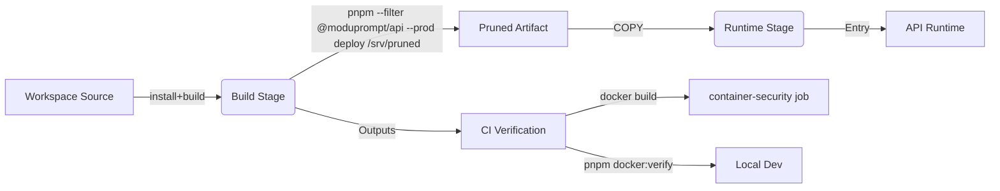

# Design Document

## Overview
This design implements the approved requirements for the docker-build-hardening spec:
- Replace the unsupported `pnpm prune --prod --filter ./...` command in `deploy/docker/Dockerfile` with a pnpm-supported workflow that produces a production-only dependency tree for the runtime image.
- Introduce automated guardrails (CI and local verification script) that fail fast on container build regressions and confirm devDependencies do not leak into the runtime image.
- Document the validated workflow in the repository docs and provide a newcomer-friendly README overhaul aligned with open-source adoption.

The approach uses `pnpm deploy` to generate a pruned artifact for the runtime stage, adds a reusable `pnpm docker:verify` script, enhances CI to use that script, and rewrites the README to give a GitHub-ready quickstart path that mirrors the verified workflow.

## Steering Document Alignment

### Technical Standards (tech.md)
- Respects the Docker-first topology by keeping `deploy/docker/Dockerfile` as the source of truth and ensuring that CI builds the same artifact (per Technical Steering “Deployment Topology” and “Development Practices”).
- Adheres to pnpm workspace conventions, using native commands instead of ad-hoc shell scripts, satisfying the directive to rely on established tooling.
- Maintains security and supply-chain scanning via Trivy, meeting the Technical Steering requirements for reliability and compliance.

### Project Structure (structure.md)
- Modifies only sanctioned deployment assets under `deploy/docker/` and CI workflows in `.github/workflows/`.
- Adds reusable scripts to `package.json` (workspace root) in line with structured tooling guidance.
- README rewrite follows the Structure Steering repository map by linking to docs already organized under `docs/` and `deploy/`.

## Code Reuse Analysis

### Existing Components to Leverage
- **`deploy/docker/Dockerfile`**: reuse multi-stage structure; replace the pruning stage with a deploy stage while preserving build outputs.
- **`.github/workflows/pipeline.yml`**: reuse existing `container-security` job, augment steps to call the new verification script and capture timing.
- **`docs/ops/env-vars.md`, `docs/product/quickstart.md`**: link from README instead of duplicating content.

### Integration Points
- **pnpm workspace tooling**: configure `pnpm deploy` (requires `inject-workspace-packages=true` in `.npmrc` or pnpm config) to create a portable package for the API runtime.
- **Docker Compose**: README instructions will reference `docker compose --profile core ...` consistent with `deploy/docker/docker-compose.yml`.

## Architecture

We re-stage the Docker build to use a deploy output and add verification loops:

### Modular Design Principles
- **Single File Responsibility**: Dockerfile keeps build vs runtime vs exporter separation; new script logic confined to `package.json` scripts.
- **Component Isolation**: README houses high-level onboarding, while detailed configuration remains in existing docs.
- **Service Layer Separation**: No application runtime code changes; focus remains on build pipeline and documentation.

## Components and Interfaces

### Dockerfile (deploy/docker/Dockerfile)
- **Purpose:** Produce runtime image with production dependencies only.
- **Interfaces:** `ARG NODE_VERSION`, `ARG PNPM_VERSION`, build stages `base`, `build`, `runtime-base`, `exporter`.
- **Dependencies:** pnpm CLI, workspace packages, `pnpm deploy` output directory.
- **Reuses:** Existing COPY patterns for dist/prisma assets; new stage `deploy` will reuse build outputs.

### CI Workflow (`.github/workflows/pipeline.yml`)
- **Purpose:** Build, scan, and verify Docker images and publish security reports.
- **Interfaces:** GitHub Actions jobs `quality`, `container-security`.
- **Dependencies:** pnpm scripts, Docker CLI, Trivy.
- **Reuses:** Adds call to `pnpm docker:verify` prior to `docker build` so local/CI use the same command.

### Package Scripts (`package.json`)
- **Purpose:** Provide developer-friendly entry points for Docker verification and README examples.
- **Interfaces:** `pnpm docker:verify`, `pnpm docker:build`, `pnpm docker:compose:core` (new/renamed scripts as needed).
- **Dependencies:** Docker CLI, Compose.
- **Reuses:** Wraps existing commands used in README and CI.

### README.md
- **Purpose:** Onboard open-source contributors with consistent instructions.
- **Interfaces:** Markdown sections (Overview, Features, Quickstart, Verification, Contributing, Community, License).
- **Dependencies:** Links to docs, spec workflow explanation, new scripts.

## Data Models
No application data models change.

## Error Handling

### Error Scenarios
1. **pnpm deploy misconfiguration**
   - **Handling:** Fail build with actionable message ensuring `pnpm config set inject-workspace-packages true` is applied in Docker build stage before running deploy.
   - **User Impact:** Build stops; README troubleshooting section and CI logs explain fix.

2. **Docker verification failures on local machines**
   - **Handling:** `pnpm docker:verify` exits non-zero with context (e.g., missing Docker daemon or command).
   - **User Impact:** Developer re-runs after resolving prerequisites.

## Testing Strategy

### Unit Testing
- Not required; focus on integration-level validation of build pipeline.

### Integration Testing
- Extend CI `container-security` job to run `pnpm docker:verify` (which executes `docker build` and optionally inspect outputs).
- Add script to examine runtime image (e.g., `docker run --rm moduprompt/app:verify node -e ...`) ensuring no devDependencies detected.

### End-to-End Testing
- README walkthrough acts as manual E2E; optionally add Playwright smoke referencing new instructions (documented but optional for this spec).

