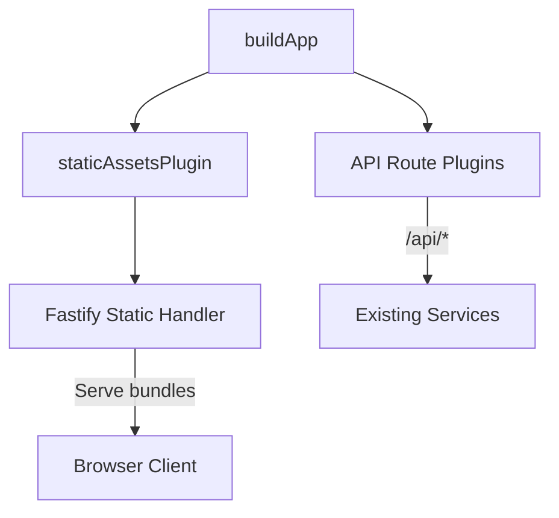

# Design Document

## Overview
Deliver the ModuPrompt PWA alongside the existing Fastify API when the Docker Compose `core` profile is launched. The runtime container already includes `apps/web/dist`; this design wires Fastify to serve static assets with a single-page application (SPA) fallback while preserving current API behaviour, health probes, and docker-build-hardening guarantees.

## Steering Document Alignment

### Technical Standards (tech.md)
- Reuses the `Fastify` runtime mandated in technical steering by registering the approved `@fastify/static` plugin instead of introducing a new web server.
- Keeps deterministic build pipeline: `pnpm build` already generates `apps/web/dist`; deployment stage will expose the existing bundle without altering compiler assumptions.
- Leverages existing logging, health checks, and security posture (CSP, sanitized rendering) defined in steering; static plugin will inherit Fastify's header controls.

### Project Structure (structure.md)
- Implementation isolated within `apps/api/src` (new `plugins/staticAssets.ts` plus bootstrap wiring) mirroring existing plugin structure for Prisma, security, exports.
- Docker changes limited to `deploy/docker/Dockerfile` and, if needed, `docker-compose.yml` (only to ensure volume/read-only settings accommodate static assets) per structure guidance.
- Tests added under `tests/e2e` or `tests/docker` respecting repo testing layout, plus optional unit coverage under `apps/api/src/modules` to maintain structure separation.

## Code Reuse Analysis

### Existing Components to Leverage
- **Fastify plugin pattern**: follow existing `plugins/exportPipeline.ts` structure for encapsulated registration and configuration.
- **Environment loader (`apps/api/src/config/env.ts`)**: optionally extend to surface `PUBLIC_ASSETS_PATH` defaulting to `../web/dist` within the runtime image.

### Integration Points
- **Fastify app bootstrap (`buildApp`)**: register static plugin before route declarations to ensure asset serving precedes API route matching.
- **Docker runtime image**: ensure `apps/web/dist` persists at predictable path (`/srv/moduprompt/apps/web/dist`) already copied during build stage; no new storage integration required.

## Architecture

The API process will mount a static file handler at `/` serving files from the embedded `apps/web/dist` directory. Requests falling outside `/api/*` will be evaluated for static assets first; unmatched paths will respond with `index.html` to support client-side routing. API routes retain existing JSON responses and error handling.

### Modular Design Principles
- Introduce `staticAssetsPlugin` (single responsibility: configure static serving and SPA fallback).
- Keep plugin configuration declarative via options object to avoid coupling with other modules.
- Preserve layered architecture: plugin only touches Fastify reply/rendering; no business logic or persistence changes required.



## Components and Interfaces

### Component 1 — `staticAssetsPlugin`
- **Purpose:** Register `@fastify/static` for `/assets/*`, set SPA fallback for non-API GETs, and configure cache headers.
- **Interfaces:** Fastify plugin `(fastify, opts)` returning void; exports typed with `FastifyPluginAsync`.
- **Dependencies:** `@fastify/static`, Node `path` utilities, `fileURLToPath` for ESM path resolution.
- **Reuses:** Aligns with existing plugin pattern; reads env config via `env.STATIC_ROOT` (new optional field referencing build path).

### Component 2 — Docker runtime adjustments
- **Purpose:** Guarantee `apps/web/dist` available at runtime and accessible read-only.
- **Interfaces:** Dockerfile COPY operations already present; may add `ENV STATIC_ROOT="/srv/moduprompt/apps/web/dist"` consumed by env loader.
- **Dependencies:** Existing build artifacts; no new packages.
- **Reuses:** Relies on current multi-stage build copying `apps/web/dist` in deploy stage.

## Data Models

No new persistent data models. Extend env schema (TypeScript `zod` definitions) with:
```
STATIC_ROOT: string // default /srv/moduprompt/apps/web/dist
```
Used only for runtime configuration.

## Error Handling

### Error Scenarios
1. **Static directory missing**
   - **Handling:** Plugin registers Fastify `onReady` hook validating directory existence; log permanent error and fail startup with exit code 1.
   - **User Impact:** Container exits; Docker Compose restart policy surfaces error, preventing serving stale or missing assets.

2. **Request for unsupported method on static path**
   - **Handling:** Fastify static plugin returns 405; ensure fallback only triggers on GET/HEAD to avoid masking API misuse.
   - **User Impact:** API clients receive standard error; SPA fallback unaffected.

## Testing Strategy

### Unit Testing
- Add Vitest coverage for SPA fallback handler ensuring `/foo` returns `index.html` while `/api/bogus` returns JSON 404.

### Integration Testing
- Update docker verification script to perform HTTP GET against running container (dev server) verifying status 200 and key headers (content-type `text/html`, cache-control for static assets).

### End-to-End Testing
- Extend Playwright smoke test (existing harness) to point at docker runtime, assert UI loads and initial route renders without console errors; guard behind optional flag to keep deterministic runs.
