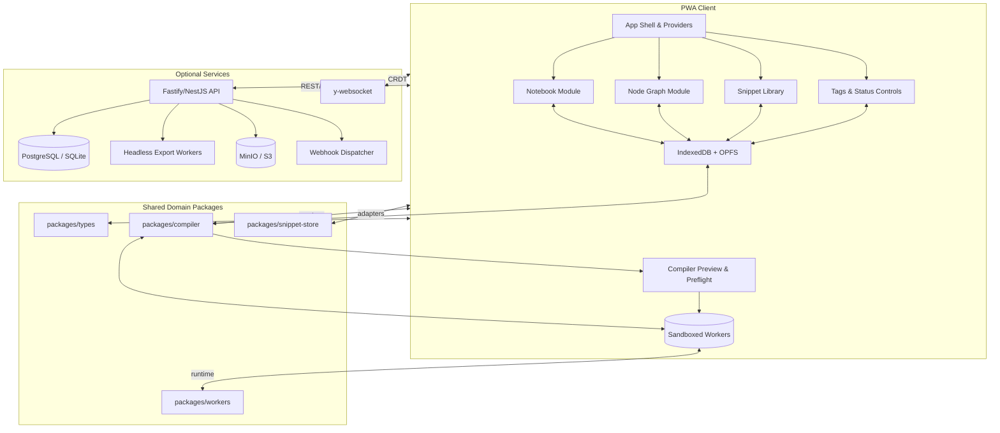

# Design Document

## Overview
- Establish the end-to-end solution architecture for ModuPrompt covering FR-1 through FR-18 and NFR-1 through NFR-8 from the approved requirements.
- Deliver a synchronized client experience (Notebook + Node) backed by a single document model, deterministic compiler, governed snippet library, and governance controls aligned with Product and Technical steering principles.
- Provide optional backend services for collaboration, exports, storage, and governance automation while keeping the PWA client authoritative for offline-first operation.

## Steering Document Alignment

### Technical Standards (tech.md)
- Client stack uses React 18, Vite, TypeScript, Tailwind, Zustand/Jotai, and TanStack Query per Technical Steering – Technology Stack, ensuring PWA readiness and strict typing.
- Domain logic is packaged into reusable pnpm workspaces (`packages/compiler`, `packages/snippet-store`, `packages/types`, `packages/workers`) to uphold modular boundaries described under Core Services & Modules.
- Sandboxed worker execution, DOMPurify sanitization, strict CSP, and distroless Docker deployment follow Security & Compliance and Deployment Topology guidance.
- Optional Fastify/NestJS API, Prisma-backed persistence, and Yjs sync services mirror the service-oriented architecture and scaling guidance defined in the technical steering document.

### Project Structure (structure.md)
- Client modules map to `apps/web/src/modules/*` (notebook, node-graph, snippets, compiler-preview, governance) with shared types in `packages/types`, consistent with Structure Steering – Frontend Structure.
- Shared logic (compiler, snippet store, workers) resides in dedicated packages under `/packages/*`, ensuring separation of presentation, domain, and worker code as mandated in Code Organization Principles.
- Backend services adopt `apps/api/src/modules/<domain>` layout with controllers/services/repositories/schemas separation, Prisma migrations, and job/event directories as outlined in Backend Structure.
- Deployment artefacts (Dockerfile, compose, Helm) remain under `/deploy/*`; documentation and ADRs under `/docs/*`, adhering to Build & Deployment Artifacts and Documentation & ADRs sections.

## Code Reuse Analysis
- Leverage unified/remark/rehype, Shiki, Mermaid, React Flow, Dexie, and Puppeteer as established in technical standards to avoid reinventing core functionality.
- Adopt pnpm workspace tooling, ESLint/Prettier, Vitest, and Playwright configurations from steering guidance to maintain consistency across modules.

### Existing Components to Leverage
- **`packages/types`**: Centralizes TypeScript interfaces and JSON Schemas for DocumentModel, Snippet, SnippetVersion, ExportRecipe, WorkspaceStatus (reuse across client and server).
- **`packages/compiler`**: Hosts deterministic compile pipeline orchestrating transclusions, variables, filters, formatters, provenance, and export adapters.
- **`packages/snippet-store`**: Provides Dexie and Prisma adapters for snippet CRUD, version logging, similarity detection, and smart folder query evaluation.
- **`packages/workers`**: Supplies sandboxed worker entrypoints for filters/formatters, Markdown rendering, and heavy transforms, aligning with security mandates.
- **`apps/web/src/state` utilities**: Houses shared Zustand stores/selectors for document model, snippet cache, governance settings, aiding parity between notebook and node views.

### Integration Points
- **Fastify API modules**: `apps/api/src/modules/snippets`, `documents`, `exports`, `governance`, and `plugins` expose REST endpoints defined in requirements FR-14; integrates with Prisma repositories and event dispatcher.
- **Storage engines**: Client Dexie stores persist document/snippet heads; optional PostgreSQL/SQLite via Prisma persists canonical versions; MinIO handles compiled export artifacts and large assets.
- **Webhooks**: `apps/api/src/modules/webhooks` publishes events (`snippet.version.created`, `document.status.changed`, `export.completed`) to n8n-compatible consumers per requirements §H.
- **AI adapters**: Optional `apps/web/src/modules/settings/ai` integrates with provider SDKs (Ollama/OpenAI) using adapter pattern defined in Technical Steering while honoring security constraints.

## Architecture
- Client remains the source of truth, running deterministic compiler, snippet versioning, governance, and preflight entirely offline with IndexedDB/OPFS. Optional backend augments collaboration, persistent audit logging, and heavy export rendering.
- Shared TypeScript contracts in `packages/types` ensure schema parity between browser and server. Compiler pipeline operates in workers to keep UI responsive, emitting provenance metadata for exports and audit logs.
- Optional backend composes Fastify API, Prisma persistence, headless export workers, y-websocket service for CRDT sync roadmap, MinIO for assets, and webhook dispatcher to downstream automation.



## Components and Interfaces

### Component – DocumentModelStore (apps/web/src/state/document-model.ts)
- **Purpose:** Maintain the canonical document model, synchronize notebook/node projections, manage schema migrations (FR-1, FR-11).
- **Interfaces:** `loadDocument(id)`, `applyBlockUpdate(blockId, patch)`, `getTopologicalOrder()`, `setStatus(statusKey)`, `setTags(tags: string[])`.
- **Dependencies:** Dexie storage adapter, schema guards from `packages/types`, governance selectors, undo/redo stack utilities.
- **Reuses:** `packages/types` schema definitions, migration utilities from `packages/snippet-store`, existing Dexie helper functions.

### Component – NotebookModule (apps/web/src/modules/notebook)
- **Purpose:** Render cell list with editing, grouping, collapsing, drag-reorder, formatter application, and snippet insertion (FR-1, FR-6, FR-7).
- **Interfaces:** `NotebookView({ documentId })`, `useNotebookCommands()`, `applyFormatter(blockId, formatterId)`.
- **Dependencies:** DocumentModelStore selectors, Monaco editor wrapper, formatters service, drag-and-drop utilities.
- **Reuses:** Shared toolbar components from `packages/ui`, command palette actions, existing Markdown importer utilities.

### Component – NodeGraphModule (apps/web/src/modules/node-graph)
- **Purpose:** Maintain DAG visualization with typed ports, auto-layout, cycle guards, subgraph support, and preview overlays (FR-1, FR-5).
- **Interfaces:** `NodeGraphCanvas({ documentId })`, `validateConnection(edge)`, `generateAutoLayout()`.
- **Dependencies:** React Flow, DocumentModelStore edges API, cycle detection helper, snippet transclusion metadata.
- **Reuses:** Styling tokens from `packages/ui`, shared validation logic from `packages/types`.

### Component – SnippetLibraryPanel (apps/web/src/modules/snippets)
- **Purpose:** Manage snippet CRUD, version timelines, diff viewer, smart folders, drag-and-drop insertion, and safe copy modes (FR-2, FR-3, FR-9).
- **Interfaces:** `SnippetTree()`, `saveSnippet(snippetId, payload)`, `createVersion(snippetId, note?)`, `revertToRevision(snippetId, rev)`, `searchSnippets(query)`.
- **Dependencies:** SnippetStore Dexie adapter, similarity service, diff rendering utilities, drag/drop integration hooks.
- **Reuses:** `packages/snippet-store` domain services, Markdown diff viewer components, command palette integration.

### Component – GovernanceControls (apps/web/src/modules/governance)
- **Purpose:** Provide tag editors, status chip selectors, policy dialogs, admin settings for status schema (FR-8).
- **Interfaces:** `StatusChip({ documentId })`, `TagEditor({ documentId })`, `StatusAdminPanel()`.
- **Dependencies:** DocumentModelStore, governance API client, color token system, accessibility utilities.
- **Reuses:** Shared modal components, typeahead library, audit log logger from `packages/snippet-store`.

### Component – CompilerPreviewPane (apps/web/src/modules/compiler-preview)
- **Purpose:** Display live Markdown/HTML preview, Mermaid rendering, preflight diagnostics, export actions (FR-5, FR-6, FR-10).
- **Interfaces:** `PreviewPane({ documentId })`, `runPreflight(documentId)`, `triggerExport(recipeId)`.
- **Dependencies:** `packages/compiler` worker API, Shiki highlighter, Mermaid sandbox component, export API client.
- **Reuses:** Worker communication utilities, toast/notification system, provenance renderer.

### Component – SnippetService (apps/api/src/modules/snippets)
- **Purpose:** Provide REST endpoints for snippet CRUD, version history, revert operations, event emission (FR-2, FR-3, FR-14).
- **Interfaces:** `listSnippets(query)`, `getSnippet(id)`, `updateSnippet(id, payload)`, `createVersion(id, note?)`, `revertVersion(id, rev)`.
- **Dependencies:** Prisma repositories, similarity analyzer, audit logger, webhook emitter.
- **Reuses:** Shared DTO schemas from `packages/types`, diff utilities from `packages/snippet-store`.

### Component – DocumentService (apps/api/src/modules/documents)
- **Purpose:** Expose document CRUD, tag/status updates, compile orchestration hooks, provenance logging (FR-8, FR-10, FR-14).
- **Interfaces:** `listDocuments(filters)`, `createDocument(payload)`, `updateDocument(id, payload)`, `setTags(id, tags)`, `setStatus(id, statusKey)`.
- **Dependencies:** Prisma models, governance policy engine, compiler job enqueueing, audit log module.
- **Reuses:** Shared validation schemas, governance policy definitions, snippet provenance cross-references.

### Component – ExportJobService (apps/api/src/modules/exports)
- **Purpose:** Queue and track export jobs, enforce status gating, persist artifacts to object storage, expose job status API (FR-5, FR-10).
- **Interfaces:** `createExportJob(documentId, recipeId)`, `getExportJob(jobId)`, `processExportJob(job)`.
- **Dependencies:** BullMQ (or lightweight queue), Puppeteer workers, storage adapters, provenance footer generator.
- **Reuses:** Compiler package, theme configuration loader, webhook dispatcher for `export.completed`.

### Component – GovernancePolicyEngine (shared between client/server)
- **Purpose:** Evaluate status gating, tag normalization, admin-configured status schema migrations, policy hooks for exports (FR-8, R-8).
- **Interfaces:** `validateStatusTransition(from, to)`, `normalizeTags(tags)`, `isExportAllowed(statusKey, recipe)`.
- **Dependencies:** WorkspaceSettings store, status schema definitions, audit logger.
- **Reuses:** Shared schema types, policy configuration persisted in Dexie/Prisma, color palette utilities.

## Data Models

### DocumentModel (packages/types/src/document.ts)
```ts
export interface DocumentModel {
  id: string;              // UUID (RFC 4122)
  title: string;
  schemaVersion: 2;
  blocks: Block[];
  edges: Edge[];
  variables: VariableDefinition[];
  exportRecipes: ExportRecipeRef[];
  tags: string[];          // deduplicated, lowercased keys (FR-8)
  statusKey: string;       // references WorkspaceStatus.key (FR-8)
  settings: { maxWidth: '80ch' | '96ch' | '120ch' };
  createdAt: number;
  updatedAt: number;
}
```

### Snippet & Version (packages/types/src/snippet.ts)
```ts
export interface Snippet {
  id: string;
  title: string;
  path: string;            // folder path e.g. marketing/intro
  frontmatter: Record<string, unknown> & { schemaVersion: 1 };
  body: string;
  headRev: number;
  createdAt: number;
  updatedAt: number;
}

export interface SnippetVersion {
  snippetId: string;
  rev: number;
  parentRev?: number;
  author?: AuthorMeta;
  note?: string;
  timestamp: number;
  body: string;
  frontmatter: Record<string, unknown>;
  hash: string;            // content hash for integrity
}
```

### ExportRecipe & WorkspaceStatus (packages/types/src/governance.ts)
```ts
export interface ExportRecipe {
  id: string;
  name: string;
  type: 'markdown' | 'html' | 'pdf' | 'text';
  include: { blocks?: string[]; groups?: string[] } | { all: true };
  theme?: ThemeSpec;
  pdf?: { margin: string; headerFooter?: boolean };
  allowedStatuses?: string[];   // gating list (FR-10)
}

export interface WorkspaceStatus {
  key: string;             // e.g. 'draft'
  name: string;            // human-friendly label
  color: string;           // hex (AA compliant per governance module)
  description?: string;
  order?: number;
  isFinal?: boolean;
}
```

### AuditLogEntry (apps/api/src/modules/audit/schemas.ts)
```ts
export interface AuditLogEntry {
  id: string;
  type: 'snippet.version.created' | 'snippet.version.reverted' | 'document.status.changed' | 'export.completed' | 'plugin.installed';
  subjectId: string;       // snippetId | documentId | pluginId | jobId
  metadata: Record<string, unknown>; // provenance, status diff, artifact URL
  actorId?: string;
  occurredAt: Date;
}
```

## Error Handling

### Error Scenarios
1. **Deterministic compile failure (status gate violation – FR-10):**
   - **Handling:** Compiler preflight returns blocking error `status_not_allowed` with allowed statuses and current status.
   - **User Impact:** Preview displays blocking banner; export button disabled; governance chip prompts status change with admin guard.

2. **Transclusion loop or missing snippet (FR-4, FR-5):**
   - **Handling:** Compiler detects cycle via DFS, returns error detailing offending snippet path or missing revision; marks document invalid until resolved.
   - **User Impact:** Notebook/node cells show inline error badges; snippet panel highlights offending item with quick actions to edit or revert.

3. **Offline sync conflict (FR-11, FR-13):**
   - **Handling:** On reconnect, diff engine compares local head vs server snapshot; if conflict, user prompted to merge using version timeline (append new revision) or create fork snapshot.
   - **User Impact:** Non-blocking modal guides through conflict resolution; autosaves remain local until resolved.

4. **Export worker failure (FR-10, NFR-3):**
   - **Handling:** Job retries with exponential backoff; after max retries, job marked failed with diagnostic logs stored; webhook emits failure event.
   - **User Impact:** User notified within app dashboard; may download diagnostic bundle or retry manually.

## Testing Strategy

### Unit Testing
- Cover document store reducers, formatter and filter utilities, compiler pipeline steps (transclusion, variable substitution, smart backtick escalation), governance policy engine, snippet version diff/revert logic (FR-3, FR-5, FR-8).
- Validate data model guards (`packages/types`) and migration scripts for schemaVersion upgrades (NFR-1, NFR-4).
- Mock worker boundaries using contract tests to ensure deterministic outputs and sanitized results (NFR-2).

### Integration Testing
- Exercise REST API modules with Prisma test database: snippet version lifecycle, document status/tag updates, compile endpoint, export job queue interactions (FR-2, FR-3, FR-10, FR-14).
- Validate Dexie ↔ compiler ↔ preview flow inside browser automation harness to confirm Notebook/Node parity (FR-1, FR-5, FR-6).
- Confirm governance policies: status gating, audit log entries, webhook payloads (FR-8, FR-10, FR-14).

### End-to-End Testing
- Playwright scenarios for key user journeys (create governed prompt, restore snippet version, offline editing session, policy-gated export) matching Requirements – User Journeys.
- Accessibility sweeps (axe-core) over Notebook, Node graph, Snippet panel, Governance dialogs to satisfy NFR-5.
- Performance scripts opening large documents (2k cells / 500 nodes) verifying interaction latency, worker responsiveness, and export durations meet NFR-1 targets.
- Security-focused E2E tests injecting malicious Markdown/filter payloads to verify sanitizer, CSP headers, and sandbox enforcement (NFR-2, §I of requirements).
