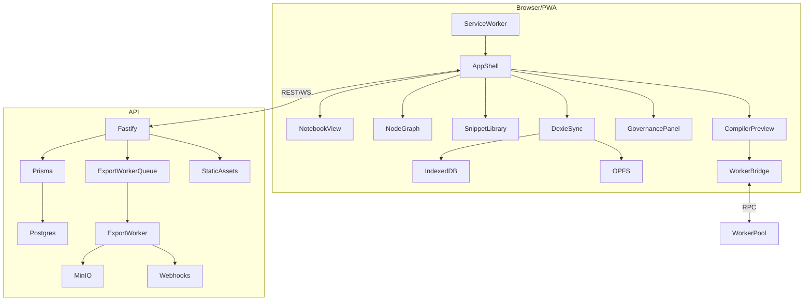

# Design Document

## Overview

Transform the current collection of TypeScript modules into a production-ready ModuPrompt application by introducing a React PWA shell, Vite build pipeline, cohesive state orchestration, and hardened Fastify delivery. The design reuses existing domain logic (`packages/types`, `packages/snippet-store`, `packages/compiler`) and API modules, layering an app shell, navigation, service worker, and offline synchronization glue so the stack aligns with steering mandates.

## Steering Document Alignment

### Technical Standards (tech.md)
- Adopt Vite + React 18 + TypeScript with Tailwind tokens, integrating Zustand/Jotai stores per steering standards.
- Expose Fastify API with zod validation, Prisma persistence, and deterministic export workers.
- Enforce CSP, DOMPurify, and worker isolation for compiler/formatter execution; reuse Dexie/OPFS adapters from `packages/snippet-store`.
- Docker-first deployment keeps Node 20.17 runtime, pnpm workspace, Prisma migrations, and optional services (MinIO, redis).

### Project Structure (structure.md)
- Create `apps/web/src/app` module hosting AppShell, router, layout, and providers; preserve feature modules under `modules/*`.
- Place Vite config, Tailwind/PostCSS files under `apps/web/` to keep workspace boundaries intact.
- Extend Fastify plugins (`staticAssets`, `security`, `prisma`) without violating module layout under `apps/api/src/modules/*`.
- Store service worker, manifest, and public assets in `apps/web/public`, aligning with `/deploy/docker` packaging.

## Code Reuse Analysis

### Existing Components to Leverage
- **`packages/types`**: Shared schema contracts for documents, snippets, exports.
- **`packages/snippet-store`**: Dexie/OPFS adapters and migration helpers for offline persistence.
- **`packages/compiler`**: Deterministic compiler pipeline and worker entry points for preview/export.
- **`apps/web/src/state`**: Document store, selectors, undo/redo utilities powering notebook/node graph.
- **`apps/api/src/modules/*`**: Reuse REST routes, services, and Prisma repositories; augment where needed for governance/export endpoints.

### Integration Points
- **Fastify Static Assets**: Serve Vite `dist/` output with hashed filenames and fallback to `index.html` for SPA routes.
- **CSP + Security Plugin**: Inject nonce or hashed-based allowlists for generated script/style assets while retaining strict policies.
- **Service Worker**: Cache shell + API requests with stale-while-revalidate, using existing export provenance metadata for integrity.
- **Dexie/OPFS**: Rehydrate document/snippet state from local stores and schedule syncs with API snapshot endpoints.

## Architecture

Implement a functional core / imperative shell structure: the React app shell orchestrates navigation, data loading, and side effects, while feature modules remain declarative and driven by stores. Fastify handles API, static assets, and security with plugin-based layering. Docker image builds compile TypeScript, run Vite, and copy hashed assets into the runtime image.



### Modular Design Principles
- **Single File Responsibility**: Create dedicated files for AppShell, router, providers, layouts, and feature entry points.
- **Component Isolation**: Keep notebook/node graph/snippet modules decoupled; use context providers for shared state.
- **Service Layer Separation**: Introduce client-side services for API interaction, worker orchestration, and storage sync.
- **Utility Modularity**: Extract reusable helpers (e.g., CSP nonce generator, cache manifest builder) under `apps/web/src/utils` or `apps/api/src/utils`.

## Components and Interfaces

### AppShell (`apps/web/src/app/AppShell.tsx`)
- **Purpose:** Bootstrap PWA, register providers (Zustand, Query, Theme), render layout with navigation and workspace selectors.
- **Interfaces:** Props include `initialWorkspaceId`, optional feature flags; exports `AppShell()` React component.
- **Dependencies:** `react-router-dom`, Zustand stores, snippet/document services, theme tokens.
- **Reuses:** `DocumentStoreProvider`, `useUndoRedo`, module exports.

### WorkspaceRouter (`apps/web/src/app/router.tsx`)
- **Purpose:** Define routes for notebook, node graph, snippets, governance, settings.
- **Interfaces:** Exposes React Router elements; accepts feature flag config.
- **Dependencies:** `react-router-dom`, lazy-loaded module entry points.
- **Reuses:** Module-level components.

### Service Worker (`apps/web/src/service-worker.ts`)
- **Purpose:** Cache shell/assets, manage offline queue for exports/snippet edits, broadcast updates.
- **Interfaces:** Workbox or custom event handlers; interacts with Dexie via MessageChannel.
- **Dependencies:** `workbox-*` or custom caching utilities.
- **Reuses:** `packages/snippet-store` manifest metadata for sync.

### API Client Layer (`apps/web/src/services/api`) 
- **Purpose:** Wrap REST endpoints with fetch/Query, handle auth headers, retries, error taxonomy.
- **Interfaces:** `DocumentsClient`, `SnippetsClient`, `ExportsClient`, `GovernanceClient` with typed methods returning zod-validated data.
- **Dependencies:** `@tanstack/query`, `@moduprompt/types`, fetch API.
- **Reuses:** API schemas.

### Static Asset Middleware (`apps/api/src/plugins/staticAssets.ts` updates)
- **Purpose:** Serve Vite manifest-driven assets with ETag, caching, HTML fallback.
- **Interfaces:** `register(app, options)` with manifest path + nonce generator.
- **Dependencies:** Fastify static plugin, Node fs/promises.
- **Reuses:** Existing plugin skeleton.

## Data Models

### Frontend Workspace State
```
interface WorkspaceState {
  activeWorkspaceId: string;
  documents: Record<string, DocumentModel>;
  snippets: Record<string, Snippet>;
  statuses: WorkspaceStatus[];
  sync:
    | { mode: 'offline'; lastBackup: number }
    | { mode: 'online'; lastSync: number; pending: number };
}
```

### Service Worker Cache Manifest
```
interface CacheManifest {
  version: string;      // hash from Vite build
  assets: string[];     // hashed JS/CSS chunks
  routes: string[];     // SPA routes to precache
  exports: { id: string; url: string; hash: string }[];
}
```

## Error Handling

### Error Scenarios
1. **Missing static asset manifest:**
   - **Handling:** Static plugin detects absent manifest, logs structured error, serves maintenance page with 503.
   - **User Impact:** Clear maintenance message; health check fails until rebuild.

2. **IndexedDB migration failure:**
   - **Handling:** Dexie migration rolls back, prompts user to export logs, retains previous schema; telemetry event recorded.
   - **User Impact:** User alerted to retry; data preserved.

3. **Export worker timeout:**
   - **Handling:** Queue retries with backoff; Fastify returns 504 with job diagnostics; webhook signals failure.
   - **User Impact:** Dashboard shows failed job with actionable message.

## Testing Strategy

### Unit Testing
- Add Vitest tests for AppShell providers, router guards, API clients, CSP utilities, Dexie migrations.
- Enforce snapshot tests for Notebook/Node Graph integration states.

### Integration Testing
- Use Playwright component/API fixtures to validate notebook ↔ API → Dexie flow, export job lifecycle, service worker registration.
- Run Prisma against test Postgres (docker compose) to ensure migrations + seed scripts succeed.

### End-to-End Testing
- Extend Playwright scenarios to cover full authoring workflow: create document, insert snippets, preview/export, simulate offline editing, restore connectivity, verify provenance logs.
- Run Docker smoke suite to validate `/` PWA load, assets served with CSP, health endpoints, and export job queue.
