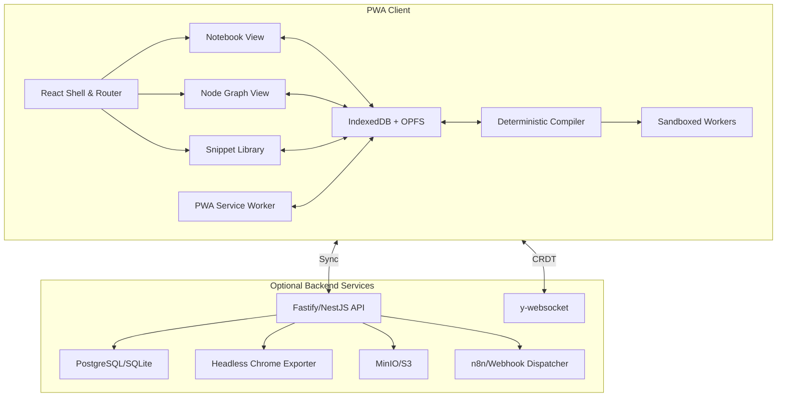

# Technical Steering – ModuPrompt

## Document Control
| Field | Value |
| --- | --- |
| Version | 1.0.0 |
| Last Updated | 2025-09-18 |
| Owner | ModuPrompt Architecture Guild |
| Review Cadence | Quarterly |

## Architecture Overview
- **System Context:** Local-first progressive web app (PWA) with optional services for collaboration, exports, and storage. Client holds authoritative document model; backend augments for sync, governance automation, and heavy rendering.
- **Primary Architectural Style:** Offline-first micro-frontend (React) backed by modular TypeScript domain layer; optional services follow service-oriented architecture with event/webhook outputs.
- **Deployment Topology:** Docker-first images orchestrated via Compose (single-user) or Kubernetes (multi-user). Default single container bundles API + static assets; optional sidecars for y-websocket, MinIO, and headless export workers.
- **Data Flow:** Shared document model persisted in IndexedDB/OPFS. Compiler pipeline runs client-side with deterministic exports; when backend present, compile requests can be offloaded to server for batch jobs.
- **Integration Points:** RESTful API (OpenAPI 3.1), webhook dispatcher (n8n-friendly JSON), plugin interface for filters/formatters, AI adapters via provider clients.

## Technology Stack
| Layer | Preferred Technologies | Rationale |
| --- | --- | --- |
| Client UI | React 18 + Vite + TypeScript + Zustand/Jotai (state) + TanStack Query | Mature ecosystem, strong PWA support, high DX, tree-shakable bundles |
| Editors | Monaco for notebook Markdown editing; custom Node-based canvas via React Flow | Rich editing capabilities, extensible, proven performance |
| Styling | Tailwind CSS + CSS Variables for theming | Rapid iteration, design tokens, dark mode readiness |
| Client Storage | IndexedDB (Dexie wrapper) + OPFS for large assets | Offline persistence, transactional integrity |
| Compiler & Markdown | unified/remark/rehype + Shiki + Mermaid (sandboxed) | Deterministic Markdown pipeline, extensible plugins |
| Backend API | Fastify (primary) or NestJS module structure, TypeScript | High performance HTTP, schema-first validation |
| Persistence | SQLite (single-user) / PostgreSQL (multi-user) | Simple local deployment, scalable cloud option |
| Realtime Sync | Yjs + y-websocket service | CRDT-based collaborative editing roadmap |
| Exports | Headless Chrome (Puppeteer) + Paged.js | High-fidelity PDF/HTML generation |
| Object Storage | MinIO (S3-compatible) | Self-hosted binary storage |
| Auth | JWT (local) with optional OIDC integration | Works offline, extendable to enterprise auth |
| CI/CD | GitHub Actions + pnpm + Playwright | Deterministic builds/tests across stack |

## Core Services & Modules
| Module | Responsibilities | Interfaces | Scaling Strategy |
| --- | --- | --- | --- |
| `app-shell` (client) | Routing, layout, service worker registration, global shortcuts | Browser APIs, SW events | Static asset scaling via CDN |
| `document-model` | Maintains shared prompt model, schema validation, migrations | Dexie, OPFS, CRDT adapter boundary | In-browser; heavy operations offloaded to workers |
| `compiler` | Resolves transclusions, variables, filters, formatters; emits deterministic exports | Worker RPC, plugin manifests | Parallelizable per document; optional server-side job queue |
| `snippet-library` | CRUD, version history, similarity detection, smart folders | IndexedDB, API sync | Local merges with eventual server sync |
| `status-governance` | Tag/status management, policy enforcement, audit logging | REST endpoints, webhook events | Stateless API + DB indexes |
| `api-gateway` | REST entrypoint, auth, validation, orchestration | Fastify routes, OpenAPI | Horizontal scale behind load balancer |
| `export-service` | PDF/HTML rendering via headless Chrome | Queue consumer, S3 artifact upload | Stateless workers scaled by job volume |
| `webhook-dispatcher` | Emits domain events to configured endpoints | HTTP POST, retry/backoff | Stateless worker with dead-letter queue |
| `ai-adapter` | Optional prompt to external model interface | Provider SDKs (Ollama/OpenAI) | Isolated network policies, per-provider throttles |

## Data Management
- **Storage Engines:** IndexedDB (client) with Dexie schema migrations; OPFS for large assets (images, attachments). Backend uses Prisma ORM over SQLite/PostgreSQL.
- **Synchronization Strategy:** Offline-first; CRDT snapshots or delta sync via Yjs planned for Phase 2. Initial releases support explicit export/import of snapshots.
- **Backup & Recovery:** Client triggers periodic export of workspace bundle (JSON + assets). Backend runs daily DB dumps and MinIO snapshots; version log ensures snippet recoverability.
- **Schema Versioning:** Document and snippet schemas include `schemaVersion`; migrations handled on load with migration scripts stored in repo. Backend migrations via Prisma migrate.

## Security & Compliance
- **Authentication & Authorization:** Local JWT auth with secure cookie or Authorization header. Admin flag controls status schema updates; future RBAC via roles matrix.
- **Data Protection:** Secrets encrypted at rest (OPFS/SQLite using libsodium wrappers). Sensitive variables flagged `secret` masked in UI/logs.
- **Threat Model Mitigations:** CSP forbids inline scripts; Markdown sanitized with DOMPurify (strict allowlist). Plugins run in workers without network/FS. Export service isolated network namespace to prevent SSRF.
- **Compliance Targets:** SOC2-friendly logging, audit trails for snippet versions/status changes. Default configuration avoids telemetry; optional OpenTelemetry integration disabled by default.
- **Dependency Hygiene:** Renovate bot for dependencies, npm audit in CI, Snyk optional. Supply-chain signing via cosign for container images.

## Reliability & Observability
- **SLIs/SLOs/SLAs:** Target 99.5% availability for optional backend; offline operations must succeed 99% of interactions. Export job success rate 99% with retries.
- **Monitoring:** pino JSON logs aggregated via Loki/ELK. Metrics via OpenTelemetry exporters (disabled by default). Health checks at `/healthz` (liveness) and `/readyz` (readiness).
- **Incident Response:** Structured runbook stored in `docs/ops/runbooks`. Automated alert thresholds for export failures, queue backlogs, response latency.

## Performance & Scalability
- **Targets:** Handle 2k notebook cells / 500 nodes under 150ms interaction latency on mid-tier hardware; exports under 10s for 50-page documents.
- **Optimization Strategies:** Virtualized lists (react-virtual), workerized heavy parsing, incremental layout for node graph, debounced autosave.
- **Scaling Levers:** Client bundling with code splitting; backend horizontal scale via containers; export workers scale by queue depth; caching compiled artifacts by content hash.

## Development Practices
- **Coding Standards:** TypeScript strict mode; ESLint + Prettier enforced. Commit messages follow Conventional Commits. Architectural Decision Records (ADRs) stored in `docs/adrs/`.
- **Testing Strategy:** Vitest for unit tests; Playwright for E2E; contract tests for REST API (Prism mock). Golden files for compiler determinism; fuzz tests for sanitizer.
- **CI/CD Pipelines:** GitHub Actions with workflows for lint/test/build, e2e (headless), Docker image build, security scans. Release pipeline tags Docker images and publishes Helm chart.

## Tooling & Dev Productivity
- **Local Dev:** `pnpm` workspace, `docker compose` profiles for optional services, `devcontainer` for VS Code. Mock data seeds for snippet library.
- **Automation:** Makefile / npm scripts for common tasks (`pnpm dev`, `pnpm test`, `pnpm lint`, `pnpm e2e`). Storybook for component documentation. GraphQL? (N/A) - REST only.
- **Documentation:** Docusaurus site for user/admin docs; Swagger UI for API during development; Markdown-based runbooks.

## Decision Log
| Date | Decision | Rationale | Status |
| --- | --- | --- | --- |
| 2025-09-18 | Initialized technical steering doc | Recorded baseline architecture & stack for ModuPrompt | Accepted |
